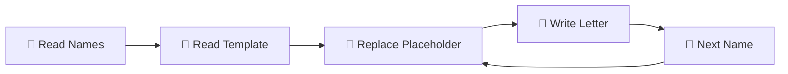

# 🗂️ Python File I/O Operations

[](https://www.python.org/downloads/)
[](https://docs.python.org/3/library/turtle.html)
[](https://docs.python.org/3/tutorial/inputoutput.html#reading-and-writing-files)
[](LICENSE)

> 📚 **Python applications demonstrating essential file handling operations through practical projects**

Two comprehensive Python projects showcasing file I/O operations, data persistence, and text processing through real-world applications.

---

## 🎯 **Projects Overview**

### 📧 **1. Mail Merge Automation**
Automated letter generation system that personalises invitations for multiple recipients.

**✨ Features:**
- 📝 Template-based letter generation
- 📋 Batch processing from name lists
- 🔄 Dynamic text replacement
- 💾 Automated file output

### 🐍 **2. Enhanced Snake Game**
Classic Snake game with modern persistent high score tracking.

**✨ Features:**
- 🎮 Full Snake gameplay with Turtle graphics
- 🏆 Persistent high score storage
- 🎯 Collision detection (walls, tail, food)
- ⚡ Smooth controls and animations

---

## 🛠️ **Technical Skills Demonstrated**

| Concept | Mail Merge | Snake Game |
|---------|------------|------------|
| **File Reading** | ✅ Names & Templates | ✅ High Score Data |
| **File Writing** | ✅ Personalised Letters | ✅ Score Persistence |
| **String Manipulation** | ✅ Text Replacement | ❌ |
| **Data Processing** | ✅ Batch Operations | ❌ |
| **OOP Design** | ❌ | ✅ Classes & Inheritance |
| **Game Development** | ❌ | ✅ Game Loop & Logic |

---

## 📁 **Project Structure**

```
python-file-io-operations/
├── 📂 Input/
│   ├── 📂 Names/
│   │   └── 📄 invited_names.txt    # List of recipients
│   └── 📂 Letters/
│       └── 📄 starting_letter.txt  # Letter template
├── 📂 Output/
│   └── 📂 ReadyToSend/
│       ├── 📄 example.txt          # Sample output
│       └── 📄 letters_for_*.docx   # Generated letters
├── 📂 enhanced_snake_game/
│   ├── 🎮 main.py              # Snake game entry point & main loop
│   ├── 🐍 snake.py             # Snake class & movement logic
│   ├── 🍎 food.py              # Food generation & positioning
│   ├── 📊 scoreboard.py        # Score tracking & persistence
│   └── 💾 data.txt             # High score storage file
├── 📄 main.py                  # Mail merge automation script
├── 📄 LICENSE                  # MIT License file
└── 📄 README.md                # Project documentation
```

---

## 🚀 **Getting Started**

### **Prerequisites**
- 🐍 Python 3.8 or higher
- 🖥️ Standard library modules (turtle, random, time)

### **Installation**
```bash
# Clone the repository
git clone https://github.com/qusai-Kagalwala/python-file-io-operations.git

# Navigate to project directory
cd python-file-io-operations
```

### **Running the Projects**

#### 📧 **Mail Merge:**
```bash
python main.py
```
**Expected Output:** Personalised letters generated in `Output/ReadyToSend/` folder

#### 🐍 **Snake Game:**
```bash
cd enhanced_snake_game
python main.py
```
**Controls:** Use arrow keys to move, click to exit

---

## 📋 **File I/O Operations Explained**

### **📖 Reading Operations**
- **`readlines()`**: Reading multiple names from file
- **`read()`**: Loading complete letter template
- **`int(data.read())`**: Loading high score as integer

### **✍️ Writing Operations**
- **Text files**: Generating personalised letters
- **Data persistence**: Saving high scores between games
- **Batch processing**: Multiple file creation

### **🔧 String Manipulation**
- **`replace()`**: Template personalisation
- **`strip()`**: Cleaning whitespace from names
- **`f-strings`**: Dynamic filename generation

---

## 🎮 **How to Play Snake Game**

1. **🎯 Objective**: Eat blue food to grow and increase score
2. **🕹️ Controls**: 
   - ⬆️ **Up Arrow**: Move up
   - ⬇️ **Down Arrow**: Move down
   - ⬅️ **Left Arrow**: Move left
   - ➡️ **Right Arrow**: Move right
3. **💀 Game Over**: Hitting walls or your own tail
4. **🏆 High Score**: Automatically saved between games

---

## 🧑‍💻 **Code Quality Features**

- 📝 **Comprehensive Comments**: Every function and section documented
- 🏗️ **Modular Design**: Separated classes and responsibilities
- 🔒 **Error Handling**: Robust file operations
- 📐 **Clean Code**: Following Python best practices
- 🎨 **Consistent Style**: Professional commenting standards

---

## 🔄 **File Operations Workflow**

### **Mail Merge Process:**


### **Snake Game Data Flow:**


---

## 🤝 **Contributing**

Contributions are welcome! Please feel free to submit a Pull Request.

1. 🍴 Fork the repository
2. 🌿 Create your feature branch (`git checkout -b feature/AmazingFeature`)
3. 💾 Commit your changes (`git commit -m 'Add some AmazingFeature'`)
4. 📤 Push to the branch (`git push origin feature/AmazingFeature`)
5. 🔀 Open a Pull Request

---

## 📜 **License**

This project is licensed under the MIT License - see the [LICENSE](LICENSE) file for details.

---

## 🙏 **Acknowledgments**

- 👩‍🏫 **Angela Yu** - 100 Days of Code Python Bootcamp
- 🐢 **Python Turtle Graphics** - For making graphics programming accessible
- 📚 **Python Documentation** - Comprehensive file I/O references

---

## 📞 **Connect with Me**

[](https://github.com/qusai-Kagalwala)
[](https://www.linkedin.com/in/qusai-kagalwala/)
[](mailto:qusai.kagalwala53@gmail.com)

---

<div align="center">

**⭐ Star this repository if you found it helpful!**

*Made with ❤️ by Qusai Kagalwala*

</div>
